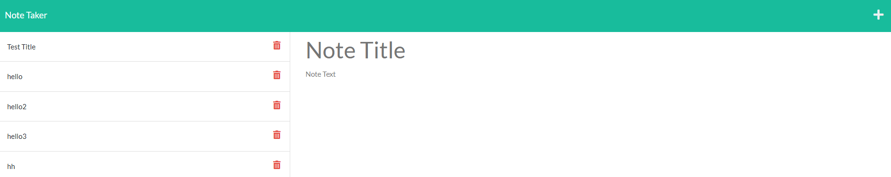

# Note Taker

## Description 

A website that allows you to take notes and save them. 

This project was my first look into using Express.js and building the back-end of websites, as well as using Heroku to deploy my website.




## Table of Contents

* [Installation](#installation)
* [Usage](#usage)
* [Credits](#credits)
* [License](#license)


## Installation

Use cmd to clone it: ```git clone ```\
or use the green code dropdown to download a zip


## Usage

 Link: https://glacial-mesa-84500.herokuapp.com/ 

 1. Click "Get Started"
 2. Type a title and some text for your note
 3. Click the save icon on the top right\
 To view previous notes, click on them on the left column\
 To clear the input fields, click the top right + icon 


## Credits

Jerome Chenette\
Manuel Nunes\
Farley


## License

[LICENSE](/LICENSE)


---


## Badges


---